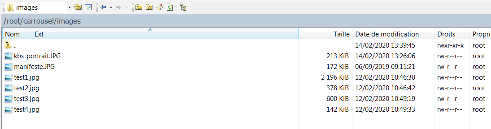
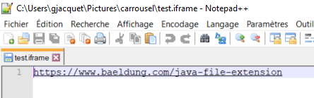
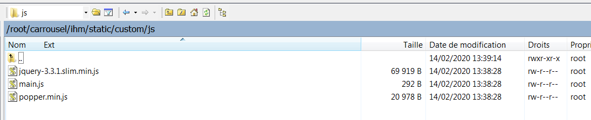
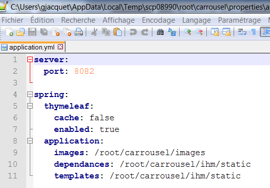

# Le carrousel

## Présentation

Application permettant la diffusion d'images sur des TV, écran.

Le but étant de partager des documents sous forme d'images ou d'iframes (rapports de PIC, DR, PERF, invitations aux communautés, photo journées respi, ..... tout ce que vous voulez ;)

## Technologies

- Java 8
- Tymeleaf
- Bootstrap

## Source

Gitlab : https://gitlab.com/guillaume-jacquet/carrousel (avec pipeline CI)

Github : https://github.com/guillaume-jacquet/carrousel

## Lancement sur eclipse :

VM arguments :
-Dspring.config.location=file:D:\carrousel\configurations-carrousel\src\main\resources\application-dev.yml

## Build

A la racine : 

```
mvn clean install
```

Cela génère un zip dans pack-carrousel/target

## Déploiement

Prendre tout le contenu du zip et le transferer sur la machine.

lancer la commande

```
[root@LILVMAPACHE carrousel]# chmod +x start_carrousel.sh
```

La commande dos2unix est peut-être jouer sur les fichiers sh

Pour démarrer l'application lancer :

```
[root@LILVMAPACHE carrousel]# ./start_carrousel.sh
```

Pour arrêter l'application lancer :

```
[root@LILVMAPACHE carrousel]# ./stop_carrousel.sh

```

## Ajouter des images

Il suffit d'ajouter des images dans le répertoire /root/carrousel/images (répertoire créé par le start)




## Ajouter des iframes

IIl suffit d'ajouter des fichiers avec l'extention ".iframe" dans le répertoire /root/carrousel/images (répertoire créé par le start).

Chaque fichier "iframe" ne contient qu'une seule URL.




## Paramétrage du carrousel 

J'ai externalisé toutes les ressources Javascript, CSS, Bootstrap

Vous pouvez donc librement modifier le carrousel dans les fichiers /root/carrousel/ihm/static/custom/js/main.js et /root/carrousel/ihm/static/custom/css/main.css




## Configuration des répertoires

Les configuration de l'application SpringBoot sont également externalisées dans /root/carrousel/properties/application.yml

Vous pouvez modifier le port de l'application ou le chemin des images, ressources...




## Pour aller plus loin

- Externaliser le répertoire templates qui contient le fichier home.html afin de pouvoir le modifier à chaud sans devoir builder et redeployer l'application.
- Dockeriser l'application
- Kubernetes ?


## Références

https://getbootstrap.com/docs/4.0/components/carousel/


